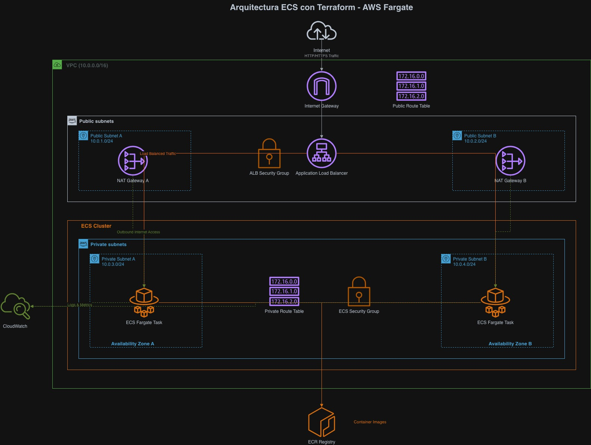

# Laboratorio: Despliegue de Aplicaciones en AWS ECS con Terraform

## Objetivo del Laboratorio

Aprender a desplegar una aplicación containerizada en AWS ECS (Elastic Container Service) utilizando Terraform como herramienta de Infrastructure as Code (IaC), integrando servicios como ECR (Elastic Container Registry) y Fargate para el manejo de contenedores sin servidor.

## Conceptos Básicos

### Terraform

**Terraform** es una herramienta de Infrastructure as Code (IaC) desarrollada por HashiCorp que permite definir y aprovisionar infraestructura de nube utilizando un lenguaje declarativo llamado HCL (HashiCorp Configuration Language).

**Características principales:**

- **Declarativo**: Describes el estado deseado de la infraestructura
- **Idempotente**: Múltiples ejecuciones producen el mismo resultado
- **Plan de ejecución**: Muestra los cambios antes de aplicarlos
- **Gestión de estado**: Mantiene un registro del estado actual de la infraestructura
- **Multi-cloud**: Compatible con múltiples proveedores de nube

**Componentes clave:**

- **Providers**: Plugins que interactúan con APIs de servicios específicos (AWS, Azure, GCP)
- **Resources**: Componentes de infraestructura (instancias EC2, VPCs, etc.)
- **Modules**: Colecciones reutilizables de recursos
- **Variables**: Valores parametrizables
- **Outputs**: Valores que se exponen tras la creación de recursos

### ECR (Elastic Container Registry)

**Amazon ECR** es un registro de contenedores Docker totalmente administrado que facilita el almacenamiento, la gestión y el despliegue de imágenes de contenedores Docker.

**Características principales:**

- **Totalmente administrado**: AWS gestiona la infraestructura del registro
- **Seguro**: Integración con IAM para control de acceso granular
- **Escalable**: Almacenamiento prácticamente ilimitado
- **Integrado**: Funciona perfectamente con ECS, EKS y otros servicios de AWS
- **Escaneo de vulnerabilidades**: Análisis automático de seguridad de imágenes

**Beneficios:**

- Eliminación de la necesidad de operar tu propio registro de contenedores
- Transferencia de datos cifrada en tránsito y en reposo
- Control de acceso detallado a nivel de repositorio
- Integración nativa con servicios de AWS

### ECS (Elastic Container Service)

**Amazon ECS** es un servicio de orquestación de contenedores altamente escalable y rápido que facilita la ejecución, detención y administración de contenedores Docker en un clúster.

**Componentes principales:**

- **Cluster**: Agrupación lógica de recursos de computación
- **Task Definition**: Plantilla que describe cómo debe ejecutarse un contenedor
- **Service**: Permite ejecutar y mantener un número deseado de tareas simultáneamente
- **Tasks**: Instanciación de una task definition en un clúster

**Modos de lanzamiento:**

1. **EC2 Launch Type**: Contenedores ejecutados en instancias EC2 que administras
2. **Fargate Launch Type**: Contenedores ejecutados en infraestructura administrada por AWS

### Fargate

**AWS Fargate** es un motor de computación sin servidor para contenedores que funciona tanto con Amazon ECS como con Amazon EKS.

**Características principales:**

- **Serverless**: No necesitas aprovisionar o administrar servidores
- **Escalabilidad automática**: Escala automáticamente según la demanda
- **Seguridad**: Aislamiento a nivel de kernel para cada tarea
- **Facturación por uso**: Pagas solo por los recursos que utilizas (vCPU y memoria)

**Beneficios:**

- Eliminación de la gestión de instancias EC2
- Mejor seguridad a través del aislamiento de tareas
- Escalabilidad más granular
- Reducción de costos operativos

## Arquitectura del Sistema

La arquitectura implementada en este laboratorio sigue las mejores prácticas de AWS para despliegues de contenedores, proporcionando alta disponibilidad, escalabilidad y seguridad.

### Diagrama de Arquitectura



### Componentes de la Arquitectura

#### 1. **Red (Networking)**

- **VPC**: Red virtual privada que aísla los recursos
- **Subnets públicas**: Para el Application Load Balancer
- **Subnets privadas**: Para las tareas ECS Fargate
- **Internet Gateway**: Permite acceso a internet desde subnets públicas
- **NAT Gateways**: Permiten salida a internet desde subnets privadas
- **Route Tables**: Definen el enrutamiento de tráfico

#### 2. **Balanceador de Carga (ALB)**

- **Application Load Balancer**: Distribuye tráfico HTTP/HTTPS
- **Target Group**: Agrupa las tareas ECS como destinos
- **Health Checks**: Verifica el estado de las aplicaciones

#### 3. **Seguridad**

- **Security Groups**: Actúan como firewalls virtuales
  - ALB Security Group: Permite tráfico HTTP/HTTPS desde internet
  - ECS Security Group: Permite tráfico desde ALB únicamente

#### 4. **Contenedores**

- **ECR Repository**: Almacena las imágenes Docker
- **ECS Cluster**: Agrupa recursos computacionales
- **ECS Service**: Mantiene el número deseado de tareas ejecutándose
- **Task Definition**: Define cómo ejecutar los contenedores
- **Fargate Tasks**: Ejecutan los contenedores sin gestión de servidores

#### 5. **Monitoreo**

- **CloudWatch Logs**: Centraliza logs de aplicaciones
- **CloudWatch Metrics**: Métricas de rendimiento y salud

### Flujo de Tráfico

1. **Entrada de usuario**: El tráfico llega desde internet al ALB
2. **Balanceo de carga**: ALB distribuye requests entre tareas ECS
3. **Procesamiento**: Las tareas Fargate procesan las peticiones
4. **Comunicación segura**: Todo el tráfico entre componentes está cifrado
5. **Logs y métricas**: CloudWatch recopila información de monitoreo

## Preparación del entorno y prerequisitos

### Herramientas Necesarias

1. **Terraform** (v1.0+)

2. **AWS CLI** configurado

3. **Docker** (para construir imágenes)

### Credenciales AWS

Configurar credenciales con permisos para:

- EC2 (VPC, Subnets, Security Groups)
- ECS (Clusters, Services, Task Definitions)
- ECR (Repositories, Images)
- ELB (Load Balancers, Target Groups)
- IAM (Roles, Policies)
- CloudWatch (Log Groups)

### Estructura del proyecto

```
ECR-LAB/
├── terraform-ecs-fargate-ecr/
│   ├── main.tf                 # Configuración principal
│   ├── variables.tf            # Variables globales
│   ├── networking/             # Módulo de red
│   ├── security_groups/        # Módulo de seguridad
│   ├── ecr/                   # Módulo ECR
│   ├── alb/                   # Módulo Load Balancer
│   └── ecs/                   # Módulo ECS
└── test-todo-app/             # Aplicación de ejemplo
```

## Módulos Terraform

El proyecto utiliza una arquitectura modular de Terraform que separa las responsabilidades en diferentes componentes. Cada módulo tiene un propósito específico y se comunica con otros mediante variables y outputs.

### Conceptos Fundamentales de Módulos

#### Variables (`variables.tf`)

Las **variables** son parámetros de entrada que permiten personalizar el comportamiento de un módulo sin modificar su código interno.

#### Main (`main.tf`)

El archivo **main** contiene la configuración principal de recursos del módulo. Define qué infraestructura se debe crear.

#### Outputs (`outputs.tf`)

Los **outputs** exponen valores generados por el módulo para que otros módulos puedan utilizarlos.

### Módulo Networking (`./networking/`)

**Propósito**: Configura toda la infraestructura de red base para la aplicación.

**Recursos principales:**

- **VPC**: Red virtual privada que aísla todos los recursos
- **Subnets públicas**: Para el Load Balancer (acceso desde internet)
- **Subnets privadas**: Para las tareas ECS (sin acceso directo desde internet)
- **Internet Gateway**: Permite acceso a internet desde subnets públicas
- **NAT Gateways**: Proporcionan acceso saliente a internet para subnets privadas
- **Route Tables**: Definen las rutas de tráfico entre subnets y gateways

**Variables clave:**

```hcl
vpc_cidr = "10.0.0.0/16"
public_subnet_cidrs = ["10.0.1.0/24", "10.0.2.0/24"]
private_subnet_cidrs = ["10.0.3.0/24", "10.0.4.0/24"]
```

### Módulo Security Groups (`./security_groups/`)

**Propósito**: Define las reglas de firewall para controlar el tráfico entre componentes.

**Recursos principales:**

- **ALB Security Group**: Permite tráfico HTTP/HTTPS (puertos 80/443) desde internet
- **ECS Security Group**: Permite tráfico solo desde el ALB hacia el puerto de la aplicación

**Reglas de seguridad:**

```hcl
# ALB: permite tráfico entrante desde internet
ingress {
  from_port   = 80
  to_port     = 80
  protocol    = "tcp"
  cidr_blocks = ["0.0.0.0/0"]
}

# ECS: permite tráfico solo desde ALB
ingress {
  from_port       = 80
  to_port         = 80
  protocol        = "tcp"
  security_groups = [alb_security_group_id]
}
```

### Módulo ECR (`./ecr/`)

**Propósito**: Gestiona el registro de contenedores Docker donde se almacenan las imágenes.

**Recursos principales:**

- **ECR Repository**: Repositorio para almacenar imágenes Docker
- **Image Scanning**: Escaneo automático de vulnerabilidades
- **Lifecycle Policy**: Gestión automática del ciclo de vida de imágenes

**Configuración:**

```hcl
image_tag_mutability = "MUTABLE"
scan_on_push = true
force_delete = true
```

### Módulo ALB (`./alb/`)

**Propósito**: Configura el Application Load Balancer para distribuir tráfico HTTP/HTTPS.

**Recursos principales:**

- **Application Load Balancer**: Balanceador de carga de capa 7
- **Target Group**: Agrupa las tareas ECS como destinos
- **Listener**: Escucha en puerto 80 y dirige tráfico al Target Group
- **Health Checks**: Verifica el estado de salud de las aplicaciones

**Configuración de Health Check:**

```hcl
health_check {
  path                = "/"
  healthy_threshold   = 2
  unhealthy_threshold = 3
  interval            = 30
}
```

### Módulo ECS (`./ecs/`)

**Propósito**: Define la orquestación de contenedores utilizando ECS con Fargate.

**Recursos principales:**

- **ECS Cluster**: Agrupación lógica de recursos computacionales
- **Task Definition**: Plantilla que define cómo ejecutar contenedores
- **ECS Service**: Mantiene el número deseado de tareas ejecutándose
- **IAM Role**: Permisos para que ECS pueda ejecutar tareas
- **CloudWatch Log Group**: Centralización de logs

**Task Definition:**

```hcl
cpu                      = "256"
memory                   = "512"
requires_compatibilities = ["FARGATE"]
network_mode            = "awsvpc"

container_definitions = [{
  name         = "angular-app"
  image        = var.repository_url
  essential    = true
  portMappings = [{
    containerPort = 80
    protocol      = "tcp"
  }]
}]
```

**Service Configuration:**

```hcl
desired_count   = 2
launch_type     = "FARGATE"
network_configuration {
  subnets         = var.private_subnet_ids
  security_groups = [var.ecs_sg_id]
  assign_public_ip = false
}
```

### Comunicación entre Módulos

Los módulos se comunican mediante **outputs** y **variables**:

```hcl
# En main.tf
module "networking" {
  source = "./networking"
  # ... variables
}

module "ecs" {
  source = "./ecs"
  vpc_id             = module.networking.vpc_id
  private_subnet_ids = module.networking.private_subnet_ids
  repository_url     = module.ecr.repository_url
  # ... más variables
}
```

Esta arquitectura modular proporciona:

- **Reutilización**: Los módulos pueden reutilizarse en diferentes entornos
- **Mantenibilidad**: Cambios aislados por componente
- **Escalabilidad**: Fácil expansión y modificación
- **Organización**: Código limpio y estructurado

### Desarrollo del laboratorio

### Paso 1: Configuración de Variables

1. **Crear archivo terraform.tfvars:**

   ```bash
   cd terraform-ecs-fargate-ecr
   cp terraform.tfvars.example terraform.tfvars
   ```

2. **Configurar variables en terraform.tfvars:**
   ```hcl
   aws_access_key    = "tu-access-key"
   aws_secret_key    = "tu-secret-key"
   ```

### Paso 2: Construcción y Subida de la Imagen Docker

1. **Preparar la aplicación:**

   ```bash
   cd ../test-todo-app
   ```

2. **Autenticar con ECR:**
   ```bash
   aws ecr get-login-password --region us-east-1 | \
   docker login --username AWS --password-stdin \
   <account-id>.dkr.ecr.us-east-1.amazonaws.com
   ```

### Paso 3: Despliegue de Infraestructura

1. **Inicializar Terraform:**

   ```bash
   cd ../terraform-ecs-fargate-ecr
   terraform init
   ```

   _Descarga los providers necesarios (AWS en este caso) y configura el backend de estado (archivo terraform.tfstate que registra qué recursos están creados y su configuración actual)_

2. **Revisar el plan de ejecución:**

   ```bash
   terraform plan -out=tfplan
   ```

   _Muestra qué recursos se crearán, modificarán o eliminarán sin ejecutar cambios_

3. **Aplicar la configuración:**
   ```bash
   terraform apply tfplan
   ```
   _Ejecuta el plan y crea la infraestructura en AWS según la configuración_

### Paso 4: Construcción y Push de la Imagen

1. **Obtener URL del repositorio ECR:**

   ```bash
   terraform output ecr_repository_url
   ```

2. **Autenticarse con ECR:**

   ```bash
   aws ecr get-login-password --region us-east-1 | \
   docker login --username AWS --password-stdin <account-id>.dkr.ecr.us-east-1.amazonaws.com
   ```

   _Autentica Docker con el registro ECR para poder subir imágenes_

3. **Construir y subir la imagen:**
   ```bash
   cd ../test-todo-app
   docker build -t my-angular-app .
   docker tag my-angular-app:latest <ecr-url>:latest
   docker push <ecr-url>:latest
   ```
   _Construye la imagen Docker localmente, la etiqueta con la URL del ECR y la sube al registro_

### Paso 5: Verificación del Despliegue

1. **Obtener URL del Load Balancer:**

   ```bash
   cd ../terraform-ecs-fargate-ecr
   terraform output alb_dns_name
   ```

2. **Verificar servicios en AWS Console:**

   - ECS → Clusters → angular-app-cluster
   - EC2 → Load Balancers
   - ECR → Repositories

3. **Probar la aplicación:**
   ```bash
   curl http://<alb-dns-name>
   ```

## Limpieza de Recursos

```bash
# Destruir infraestructura
terraform destroy

# Eliminar imágenes ECR manualmente si es necesario
aws ecr delete-repository \
  --repository-name my-angular-app \
  --force
```
